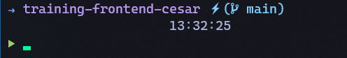
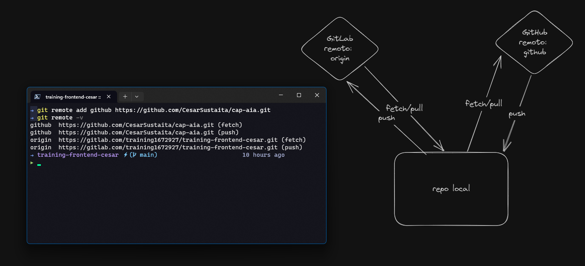

# Training Frontend César

## Introducción

Esta es la capacitación de [César](mailto:cesar.sustaita@aiapartner.com).

## Windows Terminal

Para windows terminal se han mencionado de que es un gestor por defecto de las
terminales que se tienen en el sistema por defecto de windows en el podemos
gestionar en este caso una terminal adaptada para la empresa (AIA)  al momento
de abrir poder tener las configuraciones.
****

## Git

### Remotes

sincronización de repositorios de internet

- [Link Excalidraw](https://excalidraw.com/#json=w2zLe4osBpotLTdna3hwS,epG1EBK2lkG9sc4o7QMTVQ)
- [working with remotes](https://git-scm.com/book/en/v2/Git-Basics-Working-with-Remotes)
